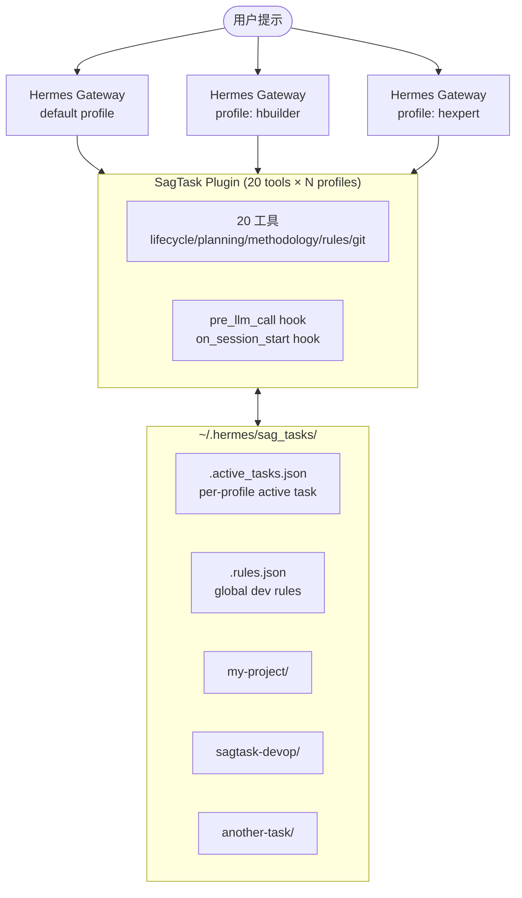
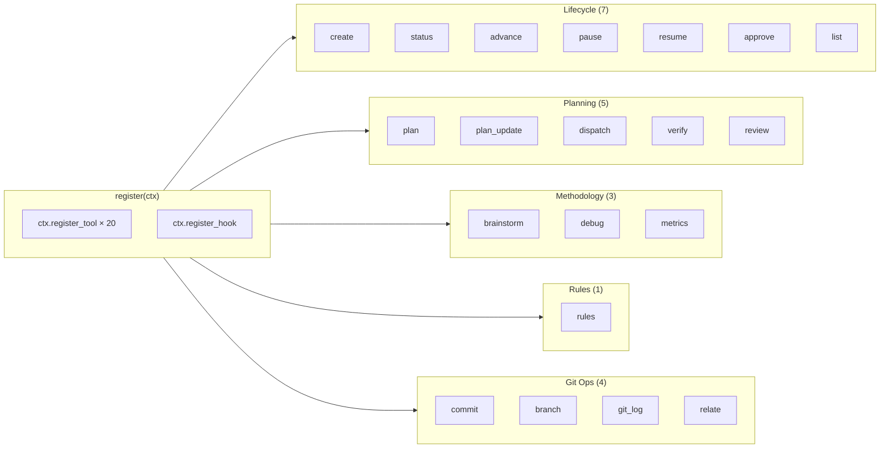
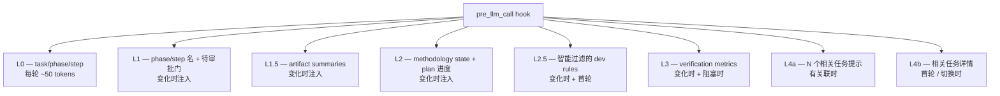
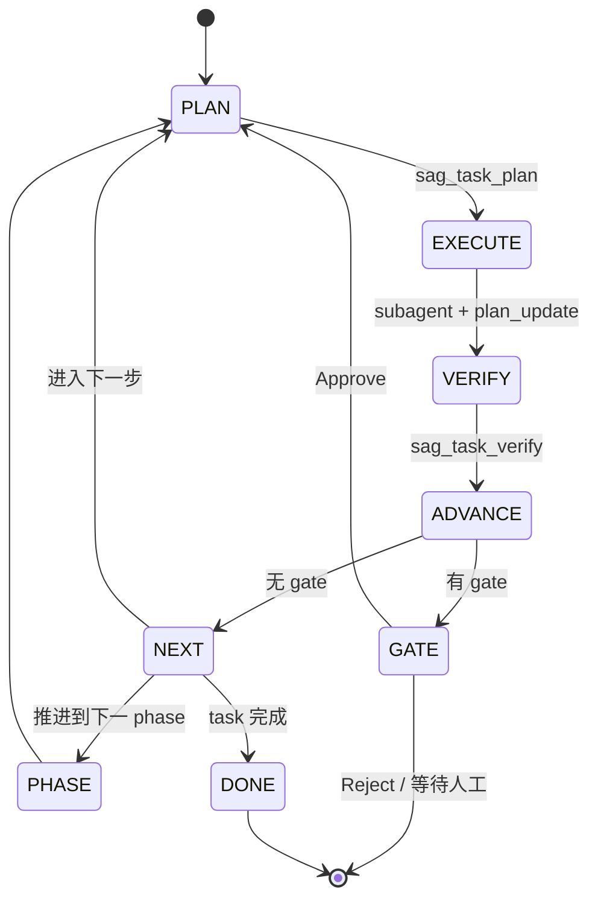
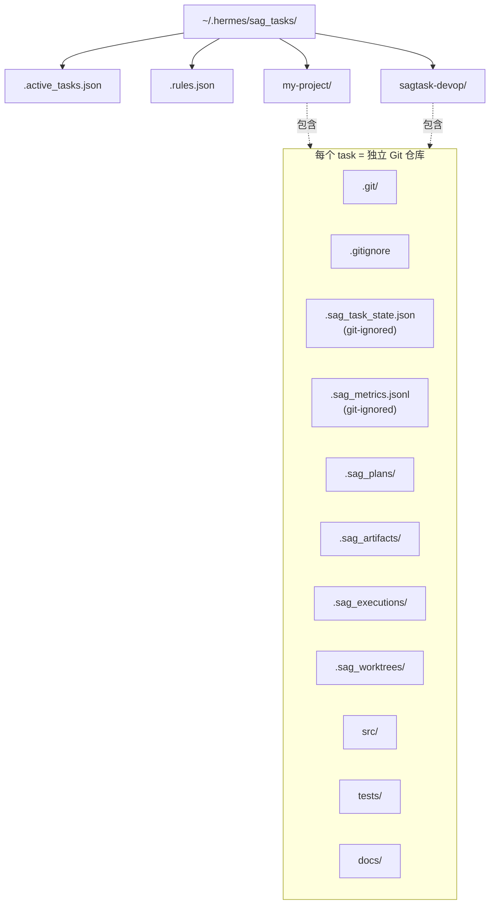
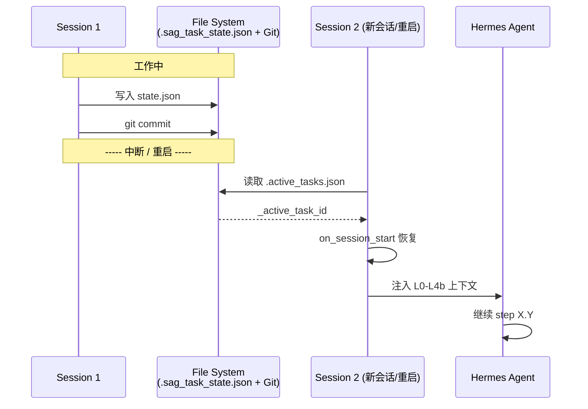

# SagTask 架构图 (Mermaid)

> GitHub / Obsidian / 任何 Markdown 渲染器自动渲染。
> 如果渲染失败，回退到 [`architecture.txt`](./architecture.txt) 的 ASCII 版本。

---

## 1. 系统全景 (System Overview)

---

## 2. 插件内部结构 (Plugin Internals)

---

## 3. 上下文注入层 (Context Injection Layers)

---

## 4. 推进生命周期 (Advance Lifecycle)

---

## 5. 任务存储布局 (Storage Layout)

---

## 6. 跨会话恢复 (Cross-Session Recovery)

---

## 7. 与 Agent 框架对比定位 (SagTask vs Others)

```mermaid
flowchart LR
    subgraph FRAMEWORKS["Agent 框架<br/>(造 agent 用)"]
        LG[LangGraph]
        AG[AutoGen]
        CA[CrewAI]
    end

    subgraph SAGTASK["SagTask<br/>(管理 agent 干的项目)"]
        ST1[Phases & Steps]
        ST2[Approval Gates]
        ST3[Cross-session state]
        ST4[Methodology engine]
        ST5[Metrics & verification]
    end

    subgraph USERS["最终用户项目"]
        P1[4 周项目]
        P2[多 Agent 协作]
        P3[需要审批的部署]
    end

    FRAMEWORKS -.生成.-> Agents[AI Agent]
    Agents --> SAGTASK
    SAGTASK --> USERS
```

**TL;DR:** 用 LangGraph/AutoGen/CrewAI *造* agent，用 SagTask *管* agent 干的项目。

---

*对应源文件：*
- *完整 ASCII 参考：[`architecture.txt`](./architecture.txt)*
- *README 内的简版 ASCII（嵌入用）：[`../README.md`](../README.md#-architecture)*
- *Cast 演示：[`demo.cast`](./demo.cast) （用 `asciinema play docs/demo.cast` 播放）*
